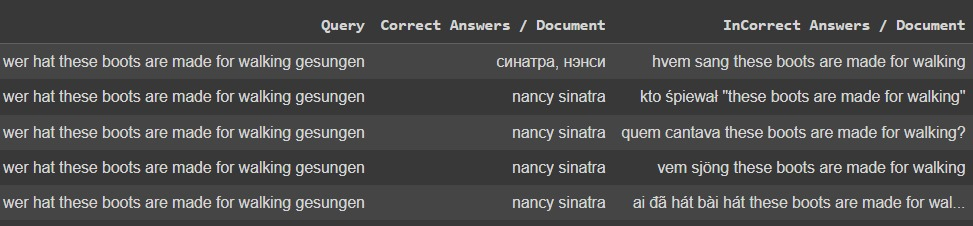
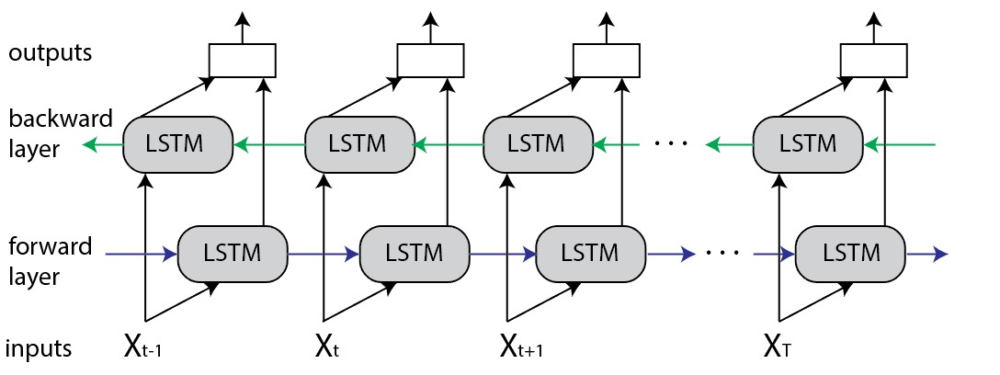
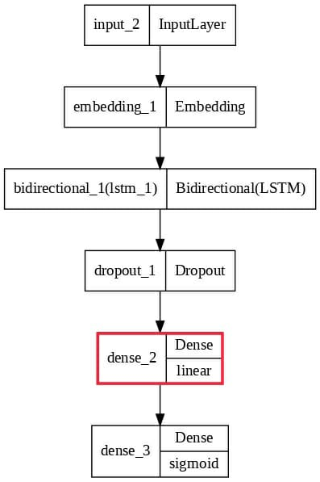

# Cross Lingual Information Retrieval

## Team Members: 
Shaun Noronha, Sheroz Shaikh

## Background and Motivation
Our proposed tool is designed to perform cross-lingual information retrieval by extracting
relevant documents from a large corpus. It operates based on user-specified queries that can be
provided in any of the seven selected languages: Arabic (Ar), Bengali (Bn), Finnish (Fi),
Japanese (Ja), Korean (Ko), Russian (Ru), and Telugu (Te). Notably, the tool can retrieve the most relevant top-k documents regardless of the language in which the query is
expressed. This feature obviates the need for machine translation (MT) to translate the query,
which can sometimes hinder retrieval performance. The tool empowers users to effortlessly
access relevant documents in multiple languages, streamlining the information retrieval process
thus avoiding potential issues related to translation quality and ambiguity.

## Dataset
### Cross-lingual Open-Retrieval Question Answering Data
We used the data available on [XOR-TyDi](https://nlp.cs.washington.edu/xorqa/)

  

### Columns

| Column |Description|
|-------|--------|
| Query | Queries in various languages |
| Correct Answers /Document | Correct answers for the documents |
| Incorrect Answers /Document | Incorrect answers for the documents |

## Exploratory Data Analysis

Among the datasets assessed for this project, the selected dataset stands out due to its unique inclusion of random instances and nuanced complexities essential for mirroring real-world scenarios. This dataset was specifically chosen for its ability to provide a comprehensive view of unpredictable and varied data patterns, ensuring our model learns from a spectrum of examples, rather than fixating on specific biases or patterns. By leveraging this dataset, our project aims to equip the model with adaptability to unforeseen scenarios, enabling it to comprehend subtle variations and edge cases commonly encountered in practical applications, thereby enhancing its robustness in real-world deployments

## Implementation

We used the data for our model as

**Training Data** 80% of the Data.
**Test Data** 20% of the Data.

For the demo, we only considered less than 1% for quick inference

### Bidirectional LSTM

Bidirectional LSTM (BiLSTM) is a recurrent neural network used primarily for natural language processing. Unlike standard LSTM, the input flows in both directions, and it’s capable of utilizing information from both sides. It’s also a powerful tool for modeling the sequential dependencies between words and phrases in both directions of the sequence.

   

### Nearest-Neighbours

A nearest-neighbors model is a technique used for searching and retrieving similar items or data points from a dataset based on their similarity to a query item. It operates on the principle that items that are close or similar in a feature space should also be similar in their inherent characteristics or properties.

The nearest-neighbors model works by organizing the dataset into a structure that efficiently retrieves the nearest or most similar items to a given query. 

### Annoy

Annoy is a library used for approximate nearest-neighbor search. It's particularly useful when dealing with high-dimensional data and finding nearest neighbors efficiently. The library provides a data structure and algorithms that enable fast approximate searches for nearest neighbors, especially in very large datasets.

It uses random projections to build trees that represent the data in a way that allows for quick lookup of approximate nearest neighbors. It's commonly used in tasks involving recommendation systems, information retrieval, clustering, and other machine-learning applications where finding similar items or data points efficiently is crucial.

### HnswLib

HNSW (Hierarchical Navigable Small World) is a library used for approximate nearest neighbor search, similar to Annoy. It's designed to efficiently locate approximate nearest neighbors in high-dimensional spaces, especially in scenarios where traditional methods might struggle due to the curse of dimensionality.

HNSW constructs a graph structure that enables fast and approximate nearest-neighbor searches by forming a hierarchical graph that organizes the data points. It builds a navigable small-world graph, which efficiently connects data points in a way that maintains both local and global connectivity, allowing for quick search operations while approximating the nearest neighbors.

#### Model Design

The model used is seen below:

  

## Conclusion & Future Work

1. The performance of the nearest neighbor search may vary across different methods (NearestNeighbors, AnnoyIndex, hnswlib). Comparing their accuracy, efficiency, and recall rates can help identify the most suitable method. 

|    |   Index_IDS |   NearestNeighbors |   AnnoyIndex |   HNSWLib |   Best_Of_3 |   Neighbours |
|----|-------------|--------------------|--------------|-----------|-------------|--------------|
|  0 |          44 |                  1 |            1 |         1 |           1 |            2 |      
|  1 |          44 |                  1 |            1 |         1 |           1 |            5 |     
|  2 |          44 |                  1 |            1 |         1 |           1 |           10 |     
|  3 |        1156 |                  1 |            1 |         1 |           1 |            2 |     
|  4 |        1156 |                  1 |            1 |         1 |           1 |            5 |     
|  5 |        1156 |                  1 |            1 |         1 |           1 |           10 |     
|  6 |        2132 |                  1 |            1 |         1 |           1 |            2 |     
|  7 |        2132 |                  1 |            1 |         1 |           1 |            5 |     
|  8 |        2132 |                  1 |            1 |         1 |           1 |           10 |     
|  9 |        9982 |                  1 |            1 |         1 |           1 |            2 |     
| 10 |        9982 |                  1 |            1 |         1 |           1 |            5 |     
| 11 |        9982 |                  1 |            1 |         1 |           1 |           10 |     
| 12 |        9995 |                  1 |            1 |         1 |           1 |            2 |     

2. Using a sentence tokenizer from the BERT family offers advantages in tokenizing text into meaningful segments. Instead of the current embedding model that learns embeddings from scratch, leveraging BERT-based tokenization can benefit the process.
3. Employing exact nearest neighbor search metrics such as cosine similarity or Euclidean distance could refine the search process. 

## GitHub Repository -  

Here is the link for the [repository](https://github.com/Iashaun/Iashaun.github.io-Cross-Lingual-Information-Retrieval-CLIR-)

### References
We took inspiration from the following papers and worked on our project

1. Shengyao Z., Linjun S., Guido Z. (2023). Augmenting Passage Representations with Query Generation for
Enhanced Cross-Lingual Dense Retrieval. SIGIR (2023), https://doi.org/10.48550/arXiv.2305.03950
2. Zhuolin J., El-Jaroudi A., William H., Damianos K., Lingjun Z. (2020). Cross-lingual Information Retrieval with
BERT. https://doi.org/10.48550/arXiv.2004.13005
3. Yulong Li, Martin Franz, Md Arafat Sultan, Bhavani Iyer, Young-Suk Lee, Avirup Sil (2022). Learning
Cross-Lingual IR from an English Retriever. NAACL (2022), https://doi.org/10.48550/arXiv.2112.08185
